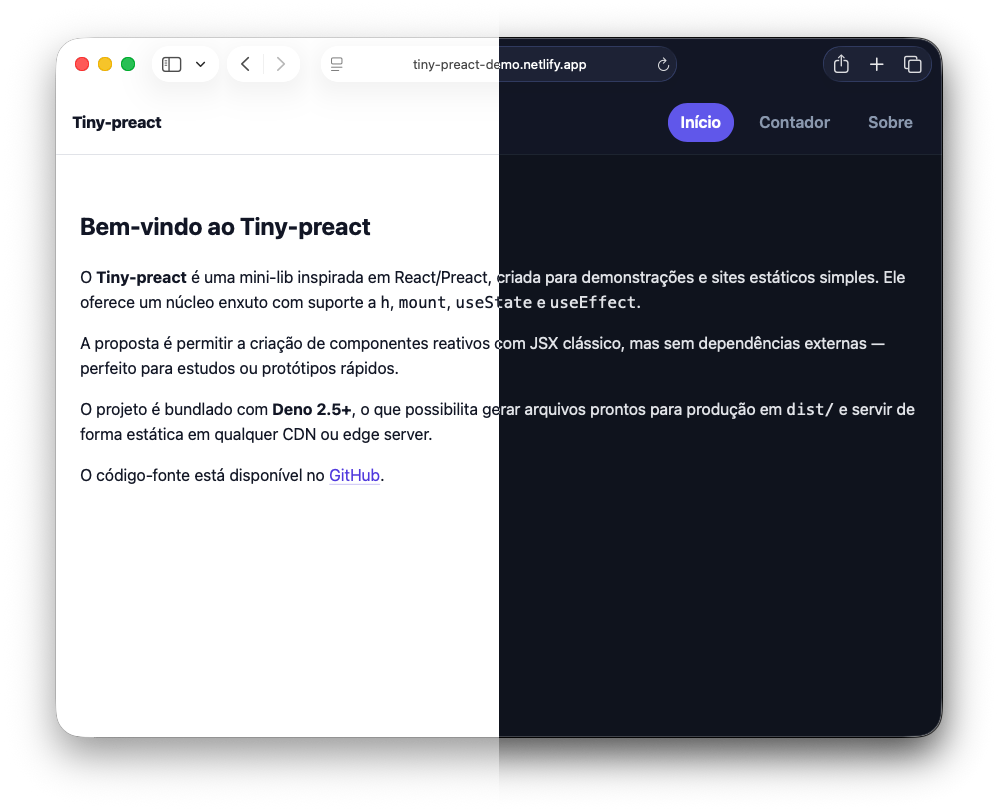

# Tiny-preact

https://tiny-preact-demo.netlify.app/

<p align="center">
  
</p>

Uma mini-lib **React/Preact-like** super simples (`src/tiny-preact.ts`) com `h`, `mount`, `useState`, `useEffect`;

## Requisitos

- Deno 2.5 ou superior (`deno --version`)

## Começo rápido

```bash
# 1) Gerar os artefatos de produção em dist/
deno task bundle

# 2) Servir os arquivos gerados
deno task serve

# 3) Abrir no navegador
# http://localhost:8000
```

### O que acontece no bundle?

- O Deno lê `src/index.html`, resolve o `<script type="module" src="./main.tsx">` e seus imports (incluindo TS/CSS);
- Emite os arquivos em `dist/` e reescreve o HTML de saída para apontar para eles;
- Fica pronto para servir em produção (edge/CDN/estático).

### Scripts (deno.json)

- `deno task bundle` — realiza o bundle com `src/index.html` como entrypoint.
- `deno task serve` — serve o diretório `dist/` em `http://localhost:8000`.

## JSX (opcional)

O projeto está configurado com **JSX clássico** e `jsxFactory: "h"` no `deno.json`.

- Dentro deste repositório, a pragma é **opcional**.
- Para portabilidade (ex.: arquivo isolado em CDN), você pode usar:

```tsx
/** @jsx h */
```

Também é possível escrever **sem JSX**, usando `h("div", ...)`.

> Observação: **Fragmentos** (`<>...</>`) não são suportados nesta lib mínima; use um elemento contêiner.

## tiny-preact (mini-lib)

Arquivo: `src/tiny-preact.ts`

Recursos:

- `h(type, props, ...children)` — cria VNodes (suporta objetos `style`, atributos, e eventos via `onClick`, etc.).
- `mount(vnode, container)` / `render(vnode, container)` — renderer com diff básico **com suporte a keys** (reconciliação chaveada).
- Hooks: `useState`, `useEffect` (efeitos executados em **microtask** logo após o commit; *não garante pós-paint*).

Tipos:

- `JSX.Element` é mapeado para `VNode` via `src/jsx.d.ts`.
- `JSX.IntrinsicElements` é aberto como um índice (`Record<string, unknown>`) para permitir tags HTML.


## Produção

- Gere o bundle e publique tudo que estiver em `dist/`.
- Em CDNs/edge (ou armazenamento de arquivos estáticos), faça upload do conteúdo de `dist/`.

## Licença

Este projeto é licenciado sob os termos da **GNU General Public License v3.0 or
later**.

Você pode acessar a licença diretamente [aqui](https://www.gnu.org/licenses/gpl-3.0.txt).

---

> Projeto desenvolvido com ❤️ por
> [@carlosxfelipe](https://github.com/carlosxfelipe). Contribuições são
> bem-vindas!
